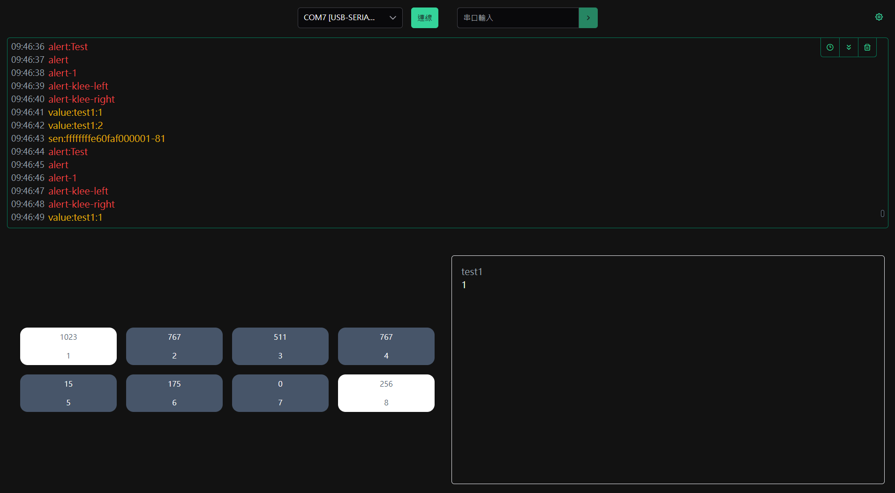
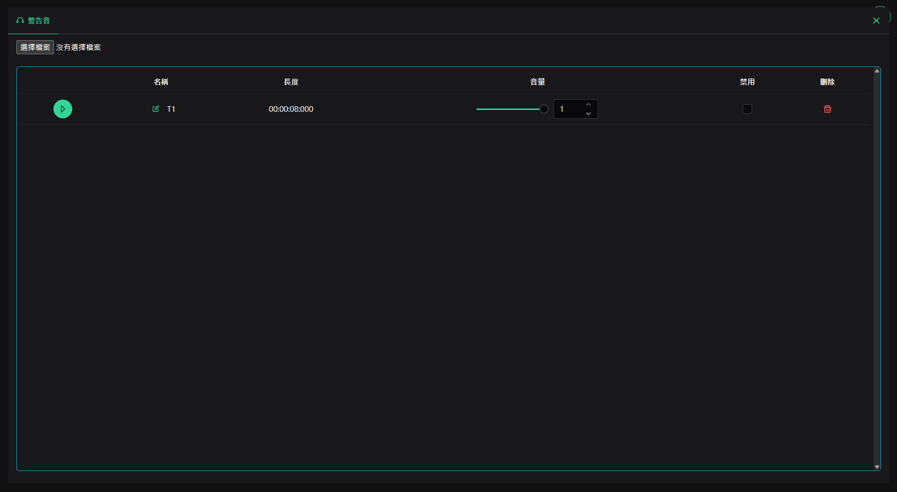

# Arduin Uno Car APP

## 設定

1. 鮑率預設為 `115200`

## 指令

1. 顯示警告訊息

  > alert:\<訊息>

2. 播放自訂音效

  > alert-\<ID>

3. 變數展示

  > value:\<name>:\<value>

4. 感測器數值展示

  > sen:\<ADC>-\<BIT>

## 範例

```cpp
#include <Arduino.h>

void debug_sensors();

void setup() {
  Serial.begin(115200);
}

uint8_t sensorBools = 0b10000001;
uint16_t sensorValues[8] = {0x3ff, 0x2ff, 0x1ff, 0x2ff,
                            0x00f, 0xaf,  0x000, 0x100};

void loop() {
  debug_sensors();
  delay(1000);
  // Serial.println("alert");
  Serial.println("alert:Test");
  delay(1000);
  Serial.println("alert");
  delay(1000);
  Serial.println("alert-1");
  delay(1000);
  Serial.println("value:test1:1");
  delay(1000);
  Serial.println("value:test1:2");
  delay(1000);

  if (Serial.available()) {
    char c = Serial.read();
    if (c == '1') {
      sensorBools ^= 0b00000001;
    } else if (c == '2') {
      sensorBools ^= 0b00000010;
    } else if (c == '3') {
      sensorBools ^= 0b00000100;
    } else if (c == '4') {
      sensorBools ^= 0b00001000;
    } else if (c == '5') {
      sensorBools ^= 0b00010000;
    } else if (c == '6') {
      sensorBools ^= 0b00100000;
    } else if (c == '7') {
      sensorBools ^= 0b01000000;
    } else if (c == '8') {
      sensorBools ^= 0b10000000;
    }
  }
}

void debug_sensors() {
  char buf[3];
  uint16_t buf1;
  uint8_t buf2 = 0, count = 0;

  Serial.print("sen:");
  for (int i = 0; i < 8; i++) {
    buf1 = sensorValues[i];
    buf2 <<= 2;
    buf2 |= buf1 >> 8;

    sprintf(buf, "%02x", buf1 & 0xff);
    Serial.print(buf);
    if (++count == 4) {
      sprintf(buf, "%02x", buf2);
      Serial.print(buf);
      buf2 = count = 0;
    }
  }
  sprintf(buf, "-%02x", sensorBools);
  Serial.print(buf);
  Serial.println();
}
```



